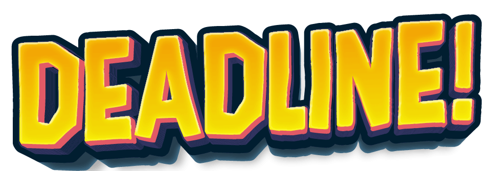

NOTE: to copy this readme structure simply click on `Raw` on the top right of this gist. There you have the content in the basic [Markdown syntax](https://www.markdownguide.org/basic-syntax/) used in readme files. Then paste it on a README.md file in your repository and fill the information. Always do this directly from VS code, not from github. DON'T ADD THIS NOTE TO YOUR README.

# DEADLINE! - The Creative Agency Game

## [Play the Game!](https://justaregularchalo.github.io/deadline-game/

)

# Description

"Deadline" is a game where you play as a creative in an agency. You must avoid useless last-minute brief revisions from your boss. Brief revisions deduct 10 points from your will to live.
Use the arrow keys to move and the space bar to jump. Collect coffee cups and memes to earn 5 will to live points. The goal is to complete creative projects and maintain your will to live.
The challenge lies in seeing how long you can hold out without giving in to those last-minute useless revisions. As you progress, the game becomes more demanding with more frequent revisions and increasing speed.

This game combines dodging and reflex skills with strategy to keep players entertained and challenged. Avoid last-minute briefs and don't let creativity surrender to idiocy with "Deadline"!”

# Main Functionalities

- Use the arrow buttons to move to left and right. ← →
- Use the space bar to jump.
- Collect the Coffees and Memes to earn 5 points of your "Will to Live"
- Avoid the las minute friday revision briefs or you will loose 10 pints from your "will to live"
- Once you reach 15 points briefs will go faster.
- When you reach over 30 points the briefs will come even faster.
- Try to avoid as many briefs as possible for as long as you can.

# Backlog Functionalities

- Different briefs that deducts different points
- A special green brief that erases the rest. (approved project without useless changes).
- Different levels based on speed.
- Work wih the margins so the charachter could move further.

# Technologies used

- HTML
- CSS
- JavaScript
- DOM Manipulation
- JS Audio() and JS Image ()

# States

- Start Screen
- Game Screen
- Game Over Screen

# Proyect Structure

## main.js

- startGame();
- resetGame();

## Game.js

- Game () {

  - this.hero = new Hero();
  - this.boss = new Boss();

  - this.memeArray;

  - this.coffeeArray;

  - this.briefArray;

  - this.score = 0;

  - this.damage;
  - this.bonus;

  - this.timer;
  - this.delayMeme;
  - this.delayCoffee;

  - this.GameOn;

  - this.currentLevel;

  - this.counter;

  - this.minutes;

  - this.seconds;

  - this.counterSeconds;

  - this.counterMinutes;

}

- memeSpawn()
- memeSound ()
- timeCounter()
- addPlusFive()
- addMinusFive()
- collisionHeroVsMeme()
- memeScreenDissapear()
- coffeeSpawn ()
- coffeeSound ()
- collisionHeroVsCoffee ()
- coffeeScreenDissapear ()
- briefSpawn ()
- hitSound ()
- collisionHeroVsBrief ()
- briefScreenDissapear ()
- playMusic ()
- stopMusic ()
- updateScore ()
- evilLaugh ()
- gameOver ()
- gameLoop ()

## Hero.js

- Hero () {

      - this.node
      - this.node.src
      - this.x;
      - this.y;
      - this.w;
      - this.h;
      - this.speedX;
      - this.jumpSpeed;

      - this.gravitySpeed;
      - this.bounce;

      - this.inAir;

      - this.marginLeft;
      - this.marginRight;

  }

- moveLeft () {}
- moveRight () {}
- jump () {}
- gravityEffect () {}
- resetPosition () {}

## Coffee.js

- Coffee () {

  - this.node
  - this.node.src
  - this.x;
  - this.y;
  - this.w;
  - this.h;
  - this.marginLeft;
  - this.marginRight;
  - this.speed;

}

- fallingMovement (){}

## Meme.js

- Meme () {

  - this.node
  - this.node.src
  - this.x;
  - this.y;
  - this.w;
  - this.h;
  - this.marginLeft;
  - this.marginRight;
  - this.speed;

}

- fallingMovement (){}

## Brief.js

- Brief () {

  - this.node
  - this.node.src
  - this.x;
  - this.y;
  - this.w;
  - this.h;
  - this.marginLeft;
  - this.marginRight;
  - this.speed;

}

- throwingMovement (){}

# Extra Links

### Slides

[Link](https://docs.google.com/presentation/d/1Nr_cgzNZlKrqQSnZC1bMWfi-G5iGa4yraAHOt4yFOWs/edit?usp=sharing)

## Deploy

[Link](https://justaregularchalo.github.io/deadline-game/)
